# NORMA FINAL PROJECT

## Overview

The online banking system can be accessed via a computer with internet access without going to the bank branch.
It is a backend application made and covers many banking transactions.
There are 4 basic services provided to customers.

* Customer Management
* Account Management
* Card Management
* Transfer Management

----

### Used Technologies

* Java 17
* Spring Boot
* Hibernate
* PostgresSql
* Docker
* Junit Test
* Integration Test
* Spring Security
* JWT
* Lombok
* Swagger v3

---

## Help

---

### Quick start in locale

```
git clone https://github.com/EnginAkin/final-project.git
$ craete database 'norma' in postgresql
$ mvn clean install
$ mvn spring-boot:run
```

----

### Quick start in docker

```
git clone https://github.com/EnginAkin/final-project.git
$ mvn clean install
$ docker build -t engbank:0.0.1 .
$ cd ./compose
$ docker-compose up
```

----

### services provided to customers details

* Sign-up
* Update user information
* Delete user
* Login
* Logout
* Create a checkin account
* Detailed view of the account activities of the checking account
* Detailed view of the account activities of the checking account with filter(
  date range)
* Create a saving account
* Detailed view of the account activities of the saving account
* Detailed view of the account activities of the saving account with filter(
  date range)
* Saving money (interest) with a maturity given from a savings account (made with schehuled)
* Create a debit card
* Create a credit card
* shopping, depositing and withdrawing with a debit card
* Shopping with credit card
* view the current debt and remaining debts of the credit card from the previous extract
* Detailed view of the account activities of the credit card account
* transfer money between accounts
* Making transfers via iban and email method
* Instant money transfer between different types currency of accounts at the current exchange rate

---

## Swagger

---------

### Postman Collection

**/postman-collections** You can import the postman collections from the directory and test the endpoints.

### Customer endpoints

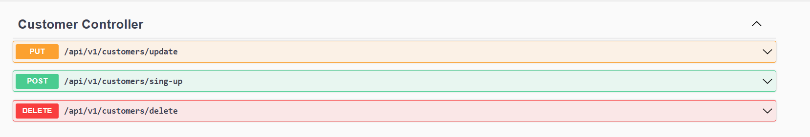

------------

### Authentication endpoints

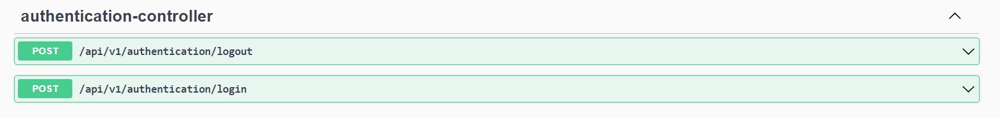

------------

### Checking account endpoints

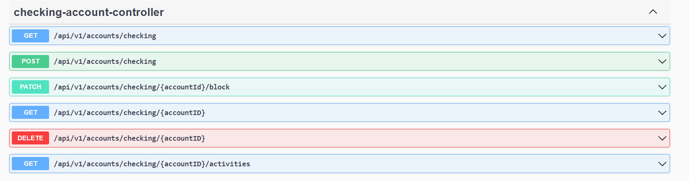

------------

### Saving account endpoints

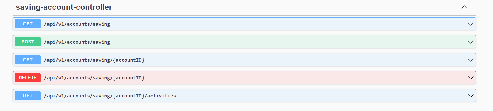

------------

### Debit card endpoints

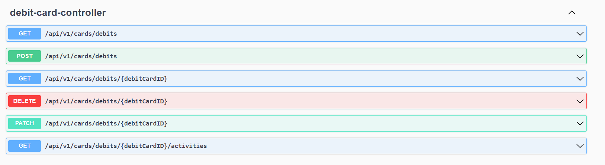

------------

### Credit card endpoints

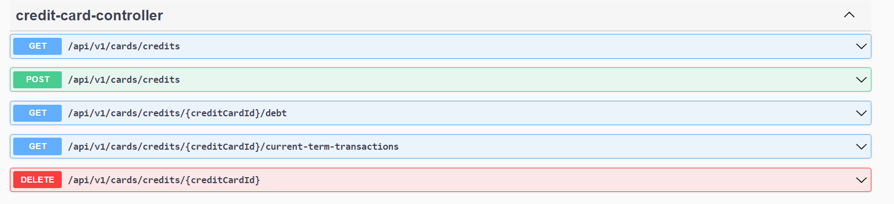

------------

### Transfer endpoints

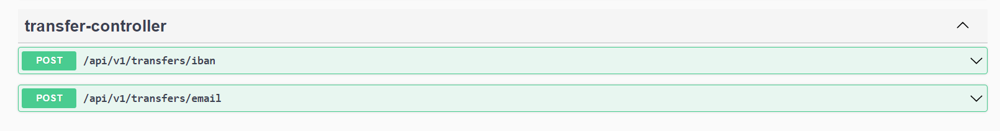

------------

### Shopping endpoints

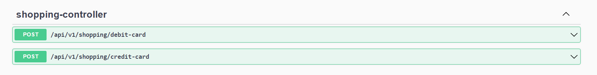

------------

### ATM endpoints

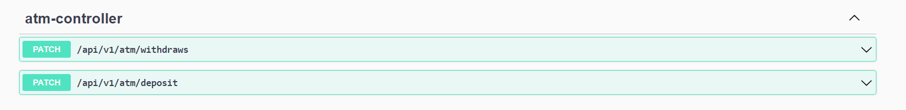

---------

### Database Diagrams

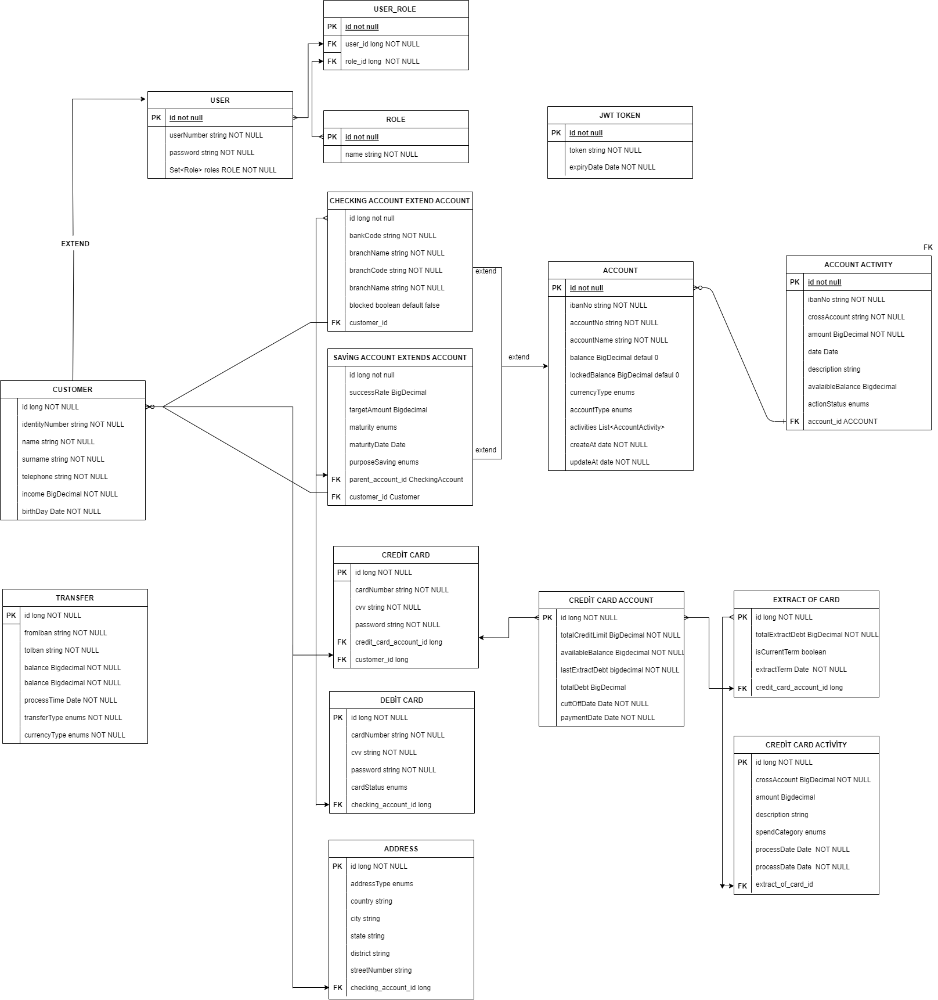

---

### Test results

* Number of test method: **125**
* To see detail test result =>  \target\site\jacoco\index.html
  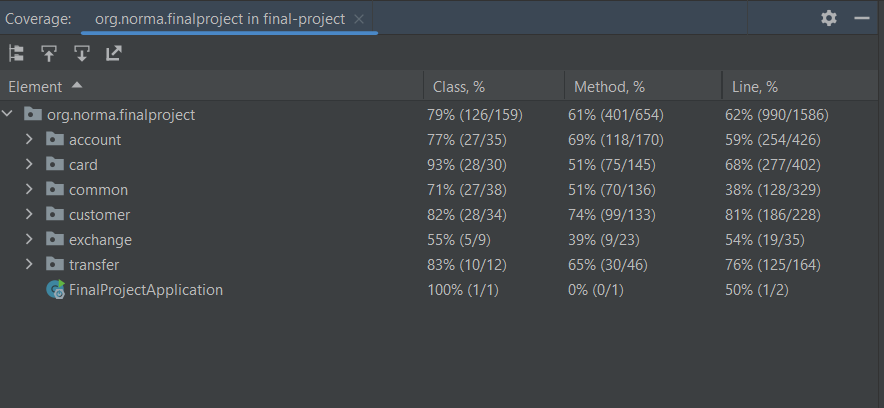
